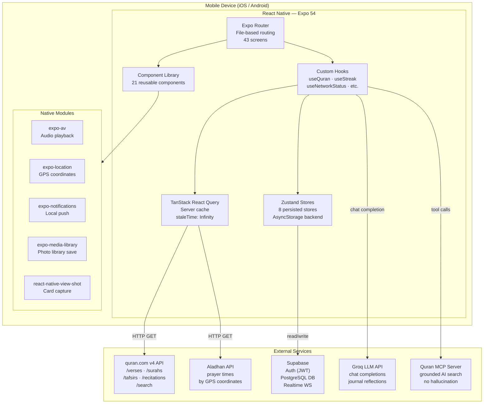
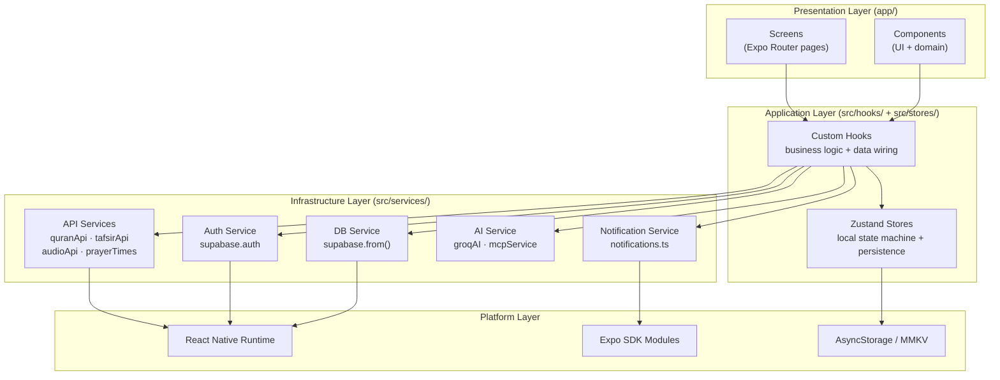
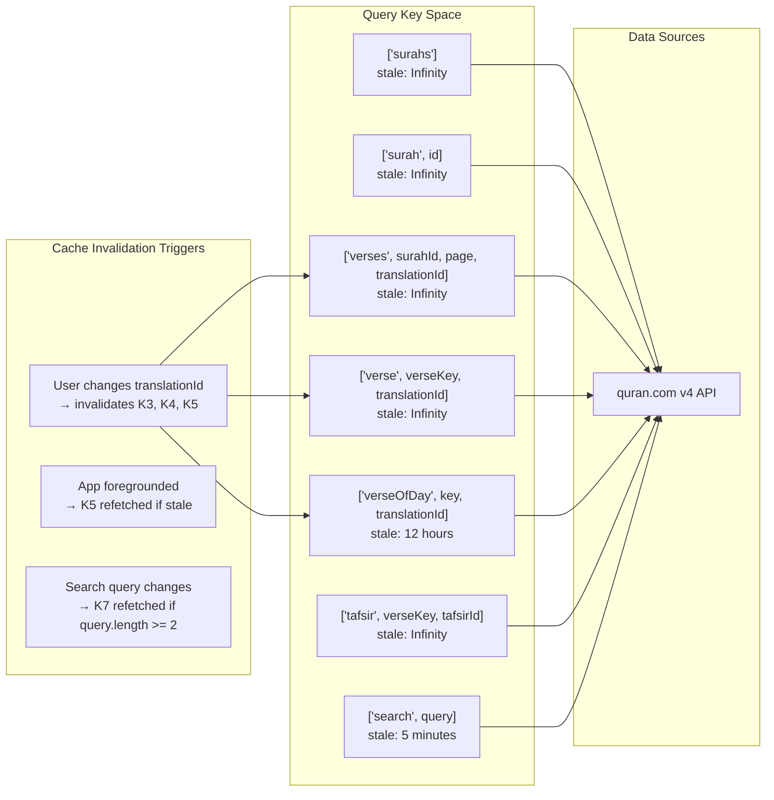
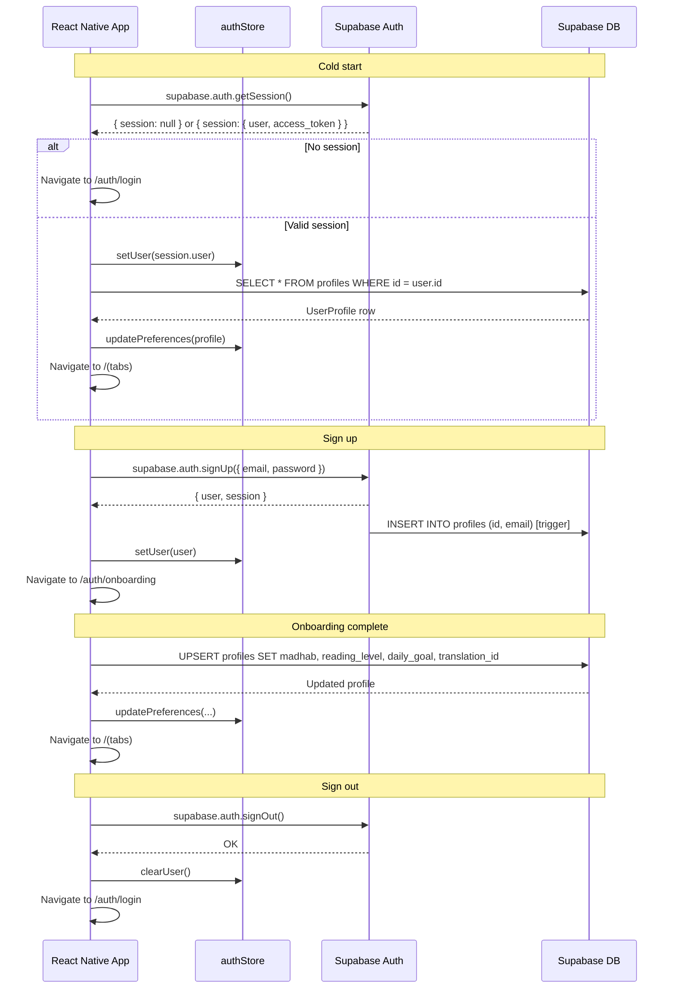
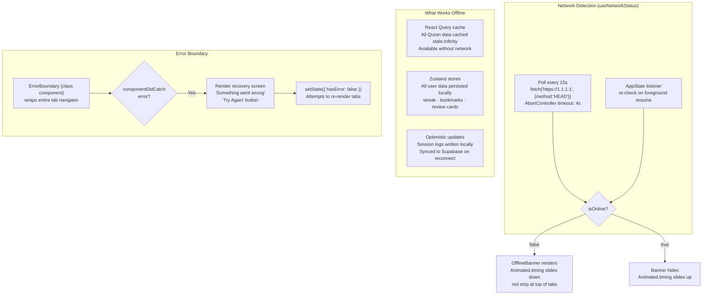
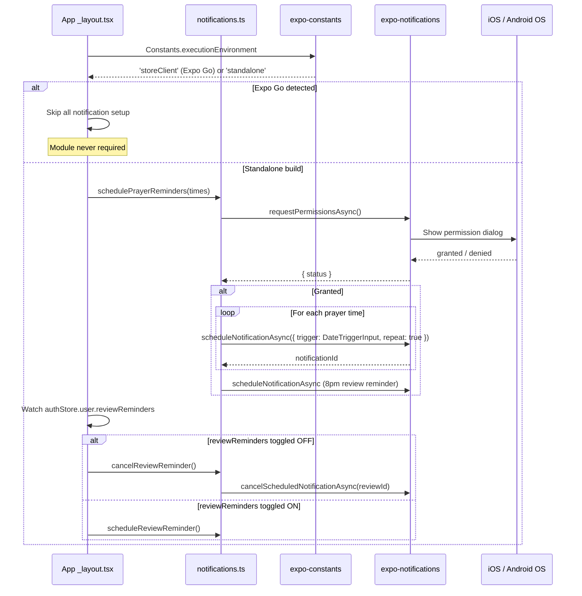
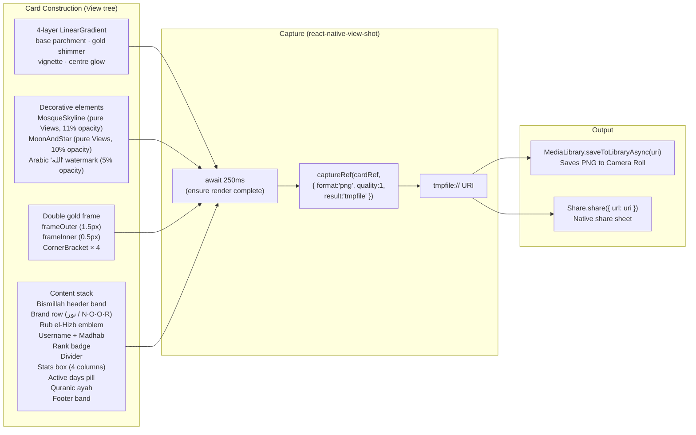

# Noor — System Architecture Diagrams

---

## 1. High-Level System Architecture

---

## 2. Layer Architecture (Clean Architecture view)

---

## 3. State Store Class Diagram

```mermaid
classDiagram
    class authStore {
        +User | null user
        +string | null session
        +setUser(user: User) void
        +clearUser() void
        +updatePreferences(prefs: Partial~UserProfile~) void
    }

    class UserProfile {
        +string id
        +string email
        +string name
        +string madhab
        +string reading_level
        +number daily_goal
        +number translationId
        +boolean nudgesEnabled
        +string[] nudgeTimes
        +boolean reviewReminders
        +boolean halaqaAlerts
    }

    class streakStore {
        +number currentStreak
        +number longestStreak
        +Record~string,DayRecord~ history
        +recordDay(data: DayRecord) void
        +getActiveDays() number
    }

    class DayRecord {
        +boolean completed
        +number versesRead
        +number dhikrCount
        +number sessionMinutes
    }

    class reviewStore {
        +ReviewCard[] cards
        +addCard(verseKey: string) void
        +getDueCards() ReviewCard[]
        +updateCard(id: string, rating: Rating) void
    }

    class ReviewCard {
        +string id
        +string verseKey
        +number easeFactor
        +number intervalDays
        +number repetitions
        +Date nextReviewAt
    }

    class engagementStore {
        +Record~FeatureKey,number~ taps
        +recordTap(feature: FeatureKey) void
        +getOrderedFeatures() FeatureKey[]
    }

    class halaqaStore {
        +Halaqa[] myCircles
        +Halaqa | null activeCircle
        +createHalaqa(data) void
        +joinHalaqa(id: string) void
        +postInsight(halaqaId, content) void
    }

    class crisisStore {
        +CrisisSession[] sessions
        +logSession(session: CrisisSession) void
        +getRecentSessions(n: number) CrisisSession[]
    }

    class savedStore {
        +Bookmark[] bookmarks
        +Collection[] collections
        +addBookmark(verseKey, note?) void
        +removeBookmark(verseKey) void
        +createCollection(name) void
        +addToCollection(colId, verseKey) void
    }

    class notificationStore {
        +Notification[] queue
        +markDelivered(id: string) void
        +addNotification(n: Notification) void
    }

    authStore --> UserProfile : contains
    streakStore --> DayRecord : history values
    reviewStore --> ReviewCard : contains
```

---

## 4. React Query Cache Architecture

---

## 5. Authentication & Session Flow

---

## 6. Offline Resilience Architecture

---

## 7. Notification Pipeline

---

## 8. Share Card Rendering Pipeline

