# Noor — Entity Relationship Diagram

Full database schema for the Noor backend (Supabase / PostgreSQL).  
All tables use UUID primary keys and Row-Level Security (`auth.uid() = user_id`).

---

## Full ER Diagram

```mermaid
erDiagram

    %% ─── Core user record ────────────────────────────────────────────────────
    USERS {
        uuid      id              PK
        string    email           "unique, not null"
        string    name
        string    madhab          "Hanafi | Maliki | Shafi_i | Hanbali"
        string    reading_level   "Beginner | Intermediate | Advanced"
        int       daily_goal      "verses per day, default 3"
        int       translation_id  "quran.com v4 ID, default 20"
        bool      nudges_enabled  "default true"
        text[]    nudge_times     "e.g. [Fajr, Maghrib]"
        bool      review_reminders "default true"
        bool      halaqa_alerts   "default true"
        timestamp created_at      "default now()"
        timestamp updated_at      "auto-updated"
    }

    %% ─── Daily worship logging ───────────────────────────────────────────────
    STREAK_DAYS {
        uuid      id              PK
        uuid      user_id         FK
        date      date            "unique per user"
        bool      completed       "true if daily_goal met"
        int       verses_read     "default 0"
        int       dhikr_count     "default 0"
        int       session_minutes "default 0"
        timestamp recorded_at     "default now()"
    }

    %% ─── Goal tracking ───────────────────────────────────────────────────────
    GOALS {
        uuid      id        PK
        uuid      user_id   FK
        string    type      "daily_verses | weekly_review | halaqa_sessions"
        int       target
        int       current   "default 0"
        date      date
        bool      completed "default false"
        timestamp created_at
    }

    %% ─── Verse bookmarks ─────────────────────────────────────────────────────
    BOOKMARKS {
        uuid      id         PK
        uuid      user_id    FK
        string    verse_key  "e.g. '2:255'"
        string    note       "optional annotation"
        timestamp created_at
    }

    %% ─── Named verse collections ─────────────────────────────────────────────
    COLLECTIONS {
        uuid      id          PK
        uuid      user_id     FK
        string    name        "e.g. 'Verses on Patience'"
        string    description
        timestamp created_at
    }

    COLLECTION_VERSES {
        uuid      id            PK
        uuid      collection_id FK
        string    verse_key
        int       position      "ordering within collection"
    }

    %% ─── Spaced repetition ───────────────────────────────────────────────────
    REVIEW_CARDS {
        uuid      id               PK
        uuid      user_id          FK
        string    verse_key
        float     ease_factor      "SM-2, default 2.5"
        int       interval_days    "days until next review"
        int       repetitions      "times reviewed successfully"
        timestamp next_review_at
        timestamp last_reviewed_at
        timestamp created_at
    }

    %% ─── Community circles ───────────────────────────────────────────────────
    HALAQAS {
        uuid      id           PK
        uuid      host_id      FK "references USERS"
        string    name
        string    description
        timestamp scheduled_at
        bool      is_active    "default true"
        timestamp created_at
    }

    HALAQA_MEMBERS {
        uuid      id          PK
        uuid      halaqa_id   FK
        uuid      user_id     FK
        string    role        "host | member"
        timestamp joined_at
    }

    HALAQA_INSIGHTS {
        uuid      id          PK
        uuid      halaqa_id   FK
        uuid      user_id     FK
        text      content
        string    verse_key   "optional verse reference"
        int       likes       "default 0"
        timestamp created_at
    }

    %% ─── Crisis support ──────────────────────────────────────────────────────
    CRISIS_SESSIONS {
        uuid      id               PK
        uuid      user_id          FK
        int       mood_before      "1-5 scale"
        int       mood_after       "1-5 scale"
        text[]    dhikr_used       "list of dhikr phrases"
        int       duration_seconds
        timestamp created_at
    }

    %% ─── Journaling ──────────────────────────────────────────────────────────
    JOURNALS {
        uuid      id             PK
        uuid      user_id        FK
        text      content
        text      ai_reflection  "Groq LLM response"
        date      entry_date     "unique per user"
        timestamp created_at
        timestamp updated_at
    }

    %% ─── Notifications ───────────────────────────────────────────────────────
    NOTIFICATIONS {
        uuid      id           PK
        uuid      user_id      FK
        string    type         "prayer | review | halaqa | nudge"
        string    title
        string    body
        timestamp scheduled_at
        bool      delivered    "default false"
        jsonb     data         "deep-link payload"
        timestamp created_at
    }

    %% ─── Relationships ───────────────────────────────────────────────────────
    USERS           ||--o{ STREAK_DAYS      : "records daily"
    USERS           ||--o{ GOALS            : "sets"
    USERS           ||--o{ BOOKMARKS        : "saves"
    USERS           ||--o{ COLLECTIONS      : "creates"
    USERS           ||--o{ REVIEW_CARDS     : "studies via SM-2"
    USERS           ||--o{ CRISIS_SESSIONS  : "logs"
    USERS           ||--o{ JOURNALS         : "writes"
    USERS           ||--o{ NOTIFICATIONS    : "receives"
    USERS           ||--o{ HALAQA_MEMBERS   : "joins"
    USERS           ||--o{ HALAQAS          : "hosts"
    COLLECTIONS     ||--o{ COLLECTION_VERSES: "contains"
    HALAQAS         ||--o{ HALAQA_MEMBERS   : "has"
    HALAQAS         ||--o{ HALAQA_INSIGHTS  : "receives"
```



---

## Table Descriptions

### `USERS`
Central profile table. Created on first signup via Supabase Auth trigger. Stores all user preferences including notification settings, translation preference, and spiritual identity fields (madhab, reading level).

### `STREAK_DAYS`
One row per user per calendar day. A day is "completed" when `verses_read >= users.daily_goal`. The streak is computed from consecutive completed days ending today.

### `GOALS`
User-defined targets (daily verse count, weekly review sessions, halaqa attendance). The `current` column is incremented by session logging and review completion triggers.

### `BOOKMARKS` + `COLLECTIONS` + `COLLECTION_VERSES`
Three-table system for saved content. Bookmarks are atomic verse saves; Collections group them into named sets with ordering. A verse can belong to multiple collections.

### `REVIEW_CARDS`
SM-2 spaced repetition state per verse per user. `ease_factor` starts at 2.5 and adjusts ±0.1–0.15 per rating. `interval_days` grows exponentially on Good/Easy ratings.

### `HALAQAS` + `HALAQA_MEMBERS` + `HALAQA_INSIGHTS`
Three-table community schema. A halaqa has one host (creator) and many members. Members can post insights (reflections on the day's passage) visible to the whole circle.

### `CRISIS_SESSIONS`
Logged automatically at the end of each crisis flow. `mood_before` / `mood_after` values are 1–5 integers from the mood chip selector. Used to show progress and recommend follow-up.

### `JOURNALS`
One entry per user per date. `ai_reflection` is populated asynchronously after the user saves their journal — a Groq LLM call processes the content and returns a spiritual reflection.

### `NOTIFICATIONS`
Records every scheduled notification. `delivered` is flipped to true via background task on send. The `data` jsonb contains the deep-link route for the in-app nudge destination.

---

## RLS Policies (example)

```sql
-- Enable on all tables
ALTER TABLE streak_days ENABLE ROW LEVEL SECURITY;

-- Standard own-data policy
CREATE POLICY "own_data" ON streak_days
  FOR ALL USING (auth.uid() = user_id);

-- Halaqa members can read all insights in their circle
CREATE POLICY "halaqa_insight_read" ON halaqa_insights
  FOR SELECT USING (
    EXISTS (
      SELECT 1 FROM halaqa_members
      WHERE halaqa_members.halaqa_id = halaqa_insights.halaqa_id
        AND halaqa_members.user_id = auth.uid()
    )
  );
```
