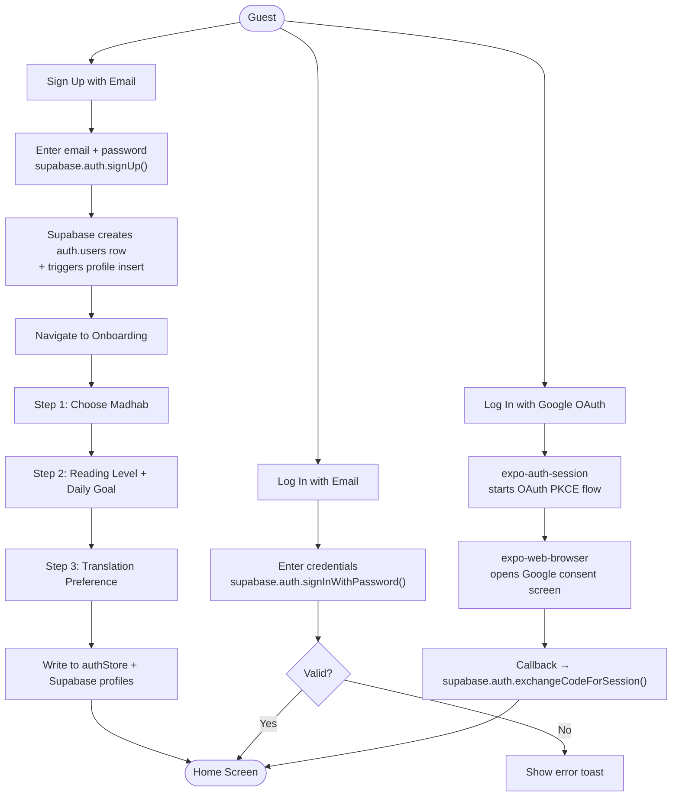
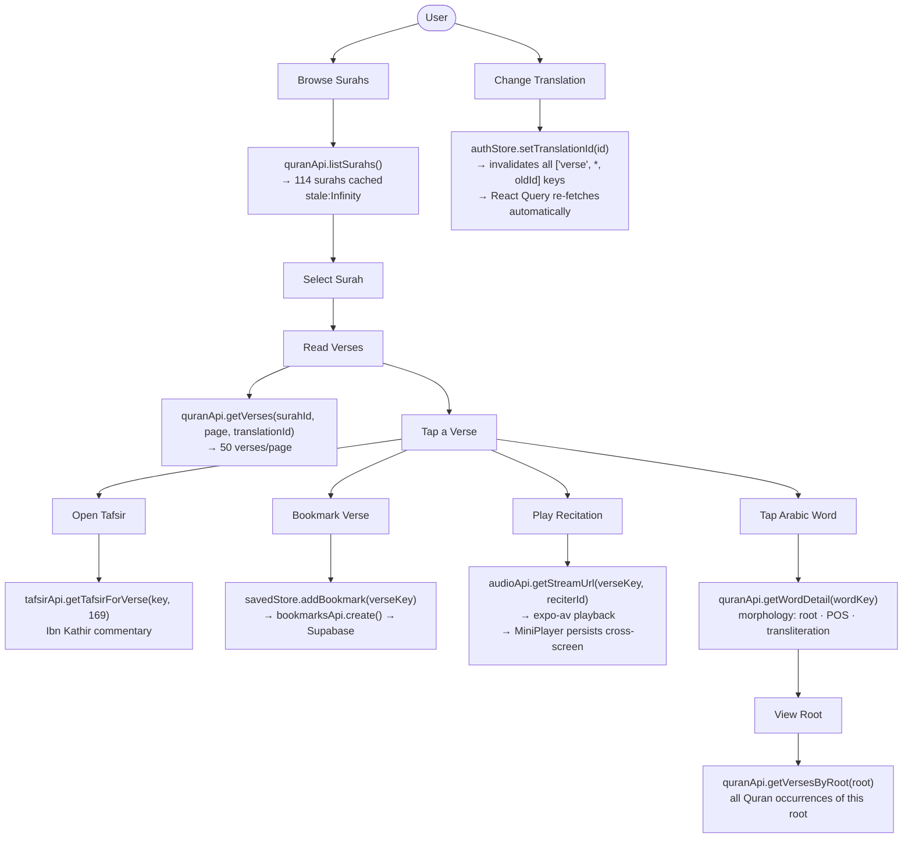
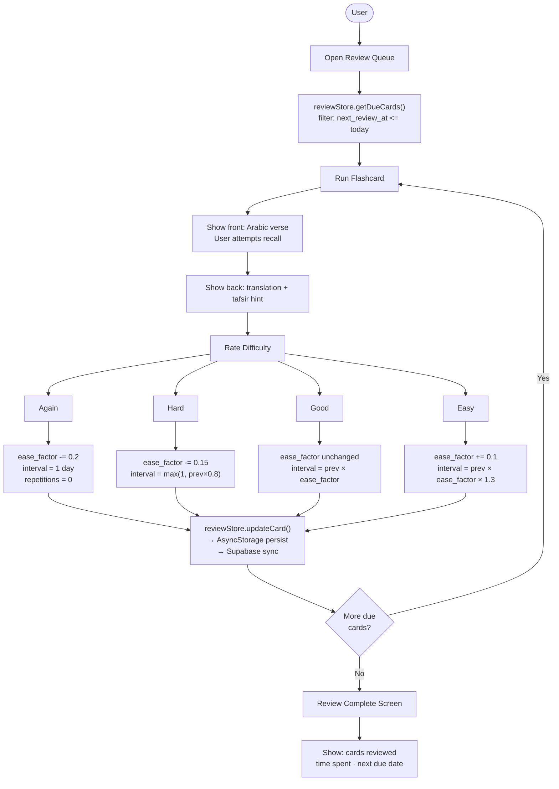
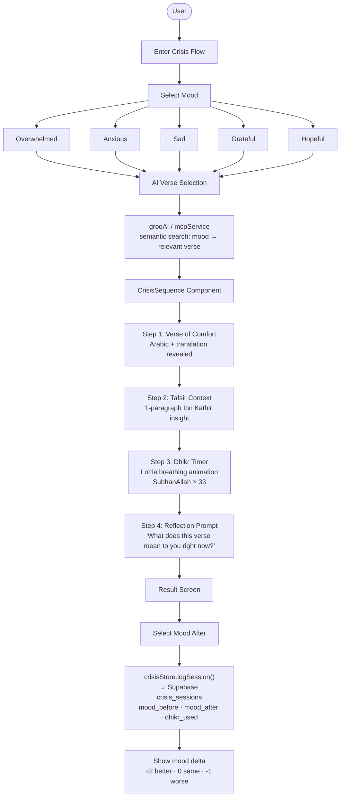
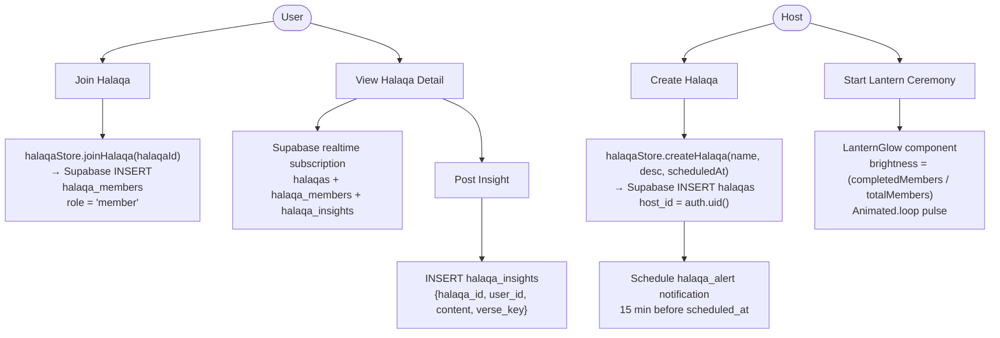
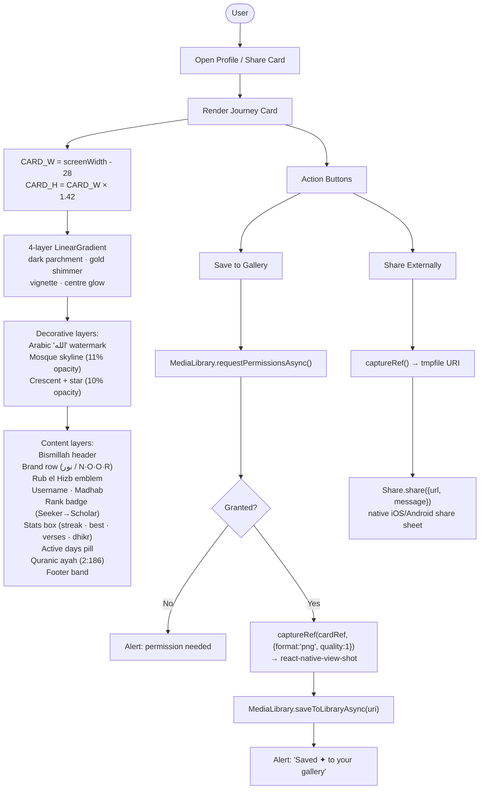

# Noor — Use Case Diagrams

All actors, use cases, and relationships across the full application.

---

## Actors

| Actor | Description |
|-------|-------------|
| **Guest** | Unauthenticated visitor — can only reach auth screens |
| **Authenticated User** | Logged-in user with full app access |
| **Halaqa Host** | Authenticated user who created a circle (extends Authenticated User) |
| **quran.com API** | External system providing verse, translation, tafsir, audio data |
| **Supabase** | Backend system handling auth, database, realtime |
| **Groq AI** | External LLM system for journal reflection |
| **expo-notifications** | Platform system for push notification delivery |

---

## Master Use Case Diagram

```mermaid
flowchart TD
    Guest([Guest])
    User([Authenticated User])
    Host([Halaqa Host\nextends User])
    QA([quran.com API])
    SB([Supabase])
    GQ([Groq AI])
    PN([expo-notifications])

    subgraph AuthUC[Authentication]
        UC_SIGNUP[Sign Up with Email]
        UC_LOGIN[Log In with Email]
        UC_GOOGLE[Log In with Google OAuth]
        UC_ONBOARD[Complete Onboarding Wizard]
        UC_LOGOUT[Sign Out]
        UC_REFRESH[Auto-refresh JWT Session]
    end

    subgraph QuranUC[Quran Study]
        UC_BROWSE[Browse 114 Surahs]
        UC_READ[Read Verses]
        UC_TRANS[Switch Translation Language]
        UC_TAFSIR[Open Tafsir Commentary]
        UC_AUDIO[Stream Audio Recitation]
        UC_SEARCH[Search Verses & Surahs]
        UC_WORD[Explore Word Morphology]
        UC_ROOT[Browse Arabic Root Cards]
        UC_GRAPH[View Concept Knowledge Graph]
        UC_BOOKMARK[Bookmark a Verse]
        UC_COLLECT[Add Verse to Collection]
    end

    subgraph WorshipUC[Daily Worship]
        UC_SESSION[Log Daily Reading Session]
        UC_DHIKR[Use Dhikr Counter]
        UC_STREAK[View Streak & Heatmap]
        UC_GOAL[Set Daily Goal]
        UC_RINGS[View Growth Rings]
        UC_BEST[View Personal Best]
    end

    subgraph ReviewUC[Spaced Repetition]
        UC_QUEUE[Open Review Queue]
        UC_FLASH[Run Flashcard Session]
        UC_RATE[Rate Card Difficulty]
        UC_HIST[View Review History]
    end

    subgraph CommunityUC[Community]
        UC_CREATE[Create Halaqa Circle]
        UC_JOIN[Join Halaqa Circle]
        UC_INSIGHT[Post Circle Insight]
        UC_LANTERN[Start Lantern Ceremony]
        UC_RECITE[Group Recitation]
        UC_MEMBERS[View Member Activity]
    end

    subgraph CrisisUC[Wellbeing & Crisis]
        UC_CRISIS[Enter Crisis Flow]
        UC_MOOD[Select Mood]
        UC_GUIDE[Follow Guided Dhikr]
        UC_MOODLOG[View Mood History]
    end

    subgraph ProfileUC[Profile & Identity]
        UC_EDIT[Edit Profile Preferences]
        UC_RANK[View Spiritual Rank]
        UC_CARD[Generate Journey Share Card]
        UC_SAVE[Save Card to Gallery]
        UC_SHARE[Share Card Externally]
        UC_LIBRARY[Browse Saved Library]
    end

    subgraph JournalUC[Journal & Reflection]
        UC_JOURNAL[Write Journal Entry]
        UC_AI[Receive AI Reflection]
        UC_REFLHIST[Browse Reflection History]
    end

    subgraph NotifUC[Notifications]
        UC_PRAYER[Enable Prayer Reminders]
        UC_REVIEWNOTIF[Set Review Reminder]
        UC_HALAQANOTIF[Receive Halaqa Alert]
    end

    %% Guest flows
    Guest --> UC_SIGNUP & UC_LOGIN & UC_GOOGLE
    UC_SIGNUP --> UC_ONBOARD --> User
    UC_LOGIN --> User
    UC_GOOGLE --> User

    %% Authenticated user flows
    User --> UC_LOGOUT & UC_REFRESH
    User --> UC_BROWSE & UC_READ & UC_TRANS & UC_TAFSIR & UC_AUDIO & UC_SEARCH
    User --> UC_WORD & UC_ROOT & UC_GRAPH & UC_BOOKMARK & UC_COLLECT
    User --> UC_SESSION & UC_DHIKR & UC_STREAK & UC_GOAL & UC_RINGS & UC_BEST
    User --> UC_QUEUE & UC_FLASH & UC_RATE & UC_HIST
    User --> UC_JOIN & UC_INSIGHT & UC_RECITE & UC_MEMBERS
    User --> UC_CRISIS & UC_MOOD & UC_GUIDE & UC_MOODLOG
    User --> UC_EDIT & UC_RANK & UC_CARD & UC_SAVE & UC_SHARE & UC_LIBRARY
    User --> UC_JOURNAL & UC_AI & UC_REFLHIST
    User --> UC_PRAYER & UC_REVIEWNOTIF & UC_HALAQANOTIF

    %% Host-only
    Host --> UC_CREATE & UC_LANTERN

    %% External system interactions
    UC_READ & UC_BROWSE --> QA
    UC_TAFSIR --> QA
    UC_AUDIO --> QA
    UC_TRANS --> QA
    UC_WORD & UC_ROOT & UC_GRAPH --> QA
    UC_SESSION & UC_STREAK --> SB
    UC_BOOKMARK & UC_COLLECT --> SB
    UC_JOURNAL --> SB
    UC_AI --> GQ
    UC_PRAYER & UC_REVIEWNOTIF & UC_HALAQANOTIF --> PN
```

---

## Authentication Use Cases (Detail)

---

## Quran Reading Use Cases (Detail)

---

## Spaced Repetition Use Cases (Detail)

---

## Crisis Flow Use Cases (Detail)

---

## Community (Halaqa) Use Cases (Detail)

---

## Share Card Use Cases (Detail)

