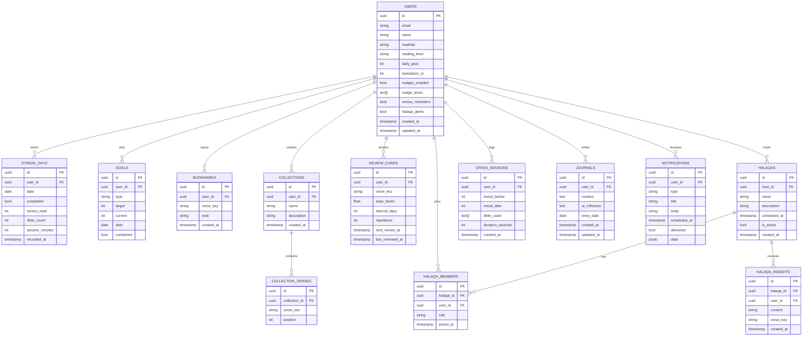
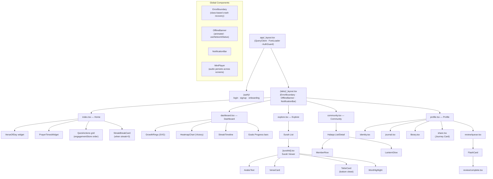
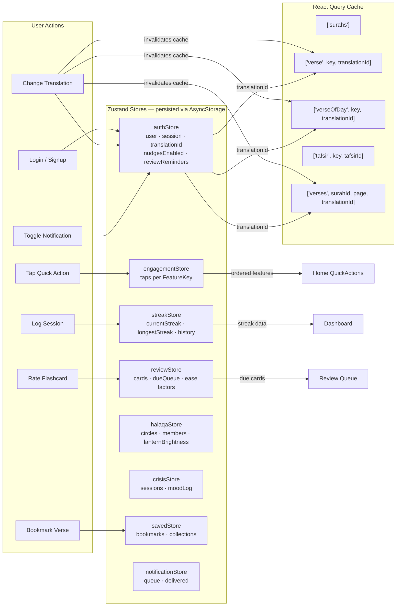
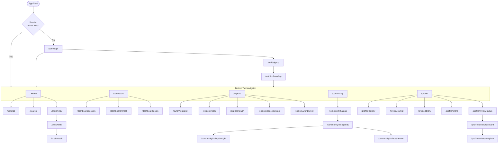
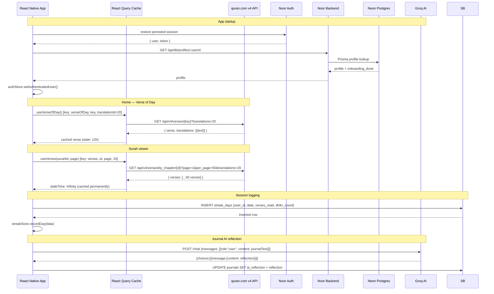
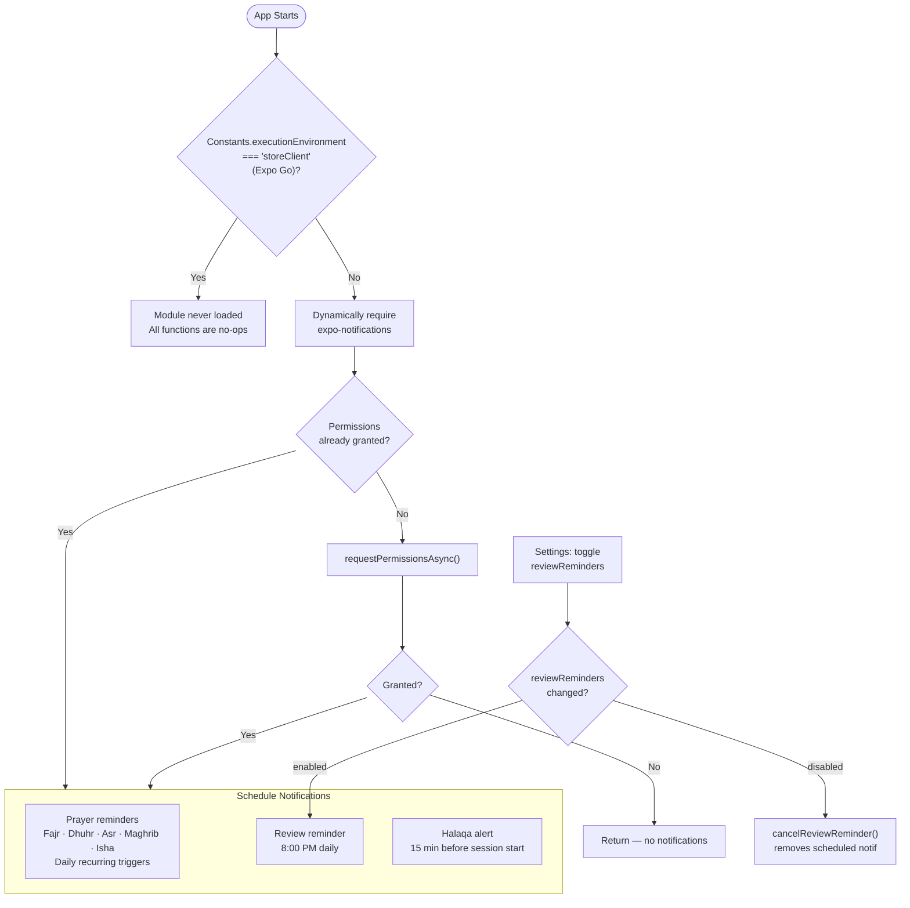

# NOOR — The Spiritual Operating System


> **Quran Foundation Hackathon 2026** · React Native · Expo 54 · TypeScript 


```
 ███╗   ██╗ ██████╗  ██████╗ ██████╗
 ████╗  ██║██╔═══██╗██╔═══██╗██╔══██╗
 ██╔██╗ ██║██║   ██║██║   ██║██████╔╝
 ██║╚██╗██║██║   ██║██║   ██║██╔══██╗
 ██║ ╚████║╚██████╔╝╚██████╔╝██║  ██║
 ╚═╝  ╚═══╝ ╚═════╝  ╚═════╝ ╚═╝  ╚═╝
      نور  ·  Light  ·  The Spiritual OS
```


---


## 🔗 Quick Links


- **Download App (APK):** [Google Drive Link](https://drive.google.com/file/d/1Yd6P8mir7YhMkuJgYvUi0kFS8OQY9uFU/view?usp=drivesdk)*


- **Website for Direct APK Download:** [NOOR Web Download](https://noor-web-download.netlify.app/)


- **YouTube Demo Video:** [Watch on YouTube](https://youtu.be/TpVoa32lhlE)
---


## Table of Contents


1. [Overview](#overview)
2. [Feature Reference](#feature-reference)
3. [System Architecture](#system-architecture)
4. [ER Diagram](#er-diagram)
5. [Use Case Diagram](#use-case-diagram)
6. [Component Hierarchy](#component-hierarchy)
7. [State Management Flow](#state-management-flow)
8. [Navigation Map](#navigation-map)
9. [API & Data Flow](#api--data-flow)
10. [Notification System](#notification-system)
11. [Design System](#design-system)
12. [Tech Stack](#tech-stack)
13. [Project Structure](#project-structure)
14. [Setup & Running](#setup--running)


---


## Overview


**Noor** ("نور", meaning "light") is a full-featured Islamic companion app targeting the single biggest problem in Muslim tech: *300 million people read the Quran during Ramadan — most stop by Eid*. Noor is built to solve post-Ramadan disengagement through three user archetypes fused into one platform:


| Archetype | Pain Point | Noor Solution |
|-----------|-----------|---------------|
| Emotional Seeker | Overwhelmed, needs comfort | Crisis Mode + contextual nudges |
| Social Learner | Loses motivation alone | Micro-Halaqas + group lantern |
| Knowledge Seeker | Wants depth, not surface reading | Knowledge graph + linguistic roots |


**Tech**: Expo 54 · React Native 0.81 · TypeScript 5.9 · Zustand 5 · TanStack React Query 5 · Noor email auth · Prisma · Neon Postgres · quran.com v4 API · Groq AI


---


## Feature Reference


### 1. Authentication & Onboarding


**Files**: `app/(auth)/login.tsx` · `app/(auth)/signup.tsx` · `app/(auth)/onboarding.tsx`


| Feature | Implementation |
|---------|---------------|
| Email + password signup/login | Noor backend auth with password hashing; no email verification step |
| Quran.Foundation OAuth | `expo-auth-session` + `expo-web-browser` with PKCE flow; backend exchanges the authorization code |
| Onboarding wizard | Madhab selection (Hanafi/Maliki/Shafi'i/Hanbali), reading level, daily verse goal, translation preference |
| Profile persistence | `authStore` (Zustand + AsyncStorage) + backend `/api/db/profiles/:userId` backed by Prisma/Neon |
| Quran OAuth identity tracking | Quran users are stored with stable IDs in the form `quran:<sub>` from the Quran.Foundation ID token |
| Auto-login | Email/password and Quran OAuth session state is persisted in `authStore` |
| Guard | Root `_layout.tsx` checks auth + per-user onboarding state before routing |
| Onboarding persistence | Completion is saved in Neon as `profiles.onboarding_done` and locally in `onboardingByUserId`, so madhab/reading-level setup is shown once per user |


---


### 2. Home Screen


**File**: `app/(tabs)/index.tsx`


| Feature | Implementation |
|---------|---------------|
| Verse of the Day | Cycles deterministically through all 6,236 Quran verses by `daysSinceEpoch % 6236`. Fetched via quran.com v4 with user's chosen translation ID |
| Prayer times widget | `PrayerTimesWidget` component — location via `expo-location`, Aladhan API, salah countdown |
| Quick actions grid | Adaptive 6-tile grid. Order driven by `engagementStore` tap counts. Recite pinned first; Settings pinned last |
| Streak break card | Coral-themed recovery card shown when `currentStreak === 0 && longestStreak > 0`. Routes to `/dashboard/session` |
| Offline banner | `OfflineBanner` — animated red strip slides in when `useNetworkStatus()` returns false |
| Error boundary | Class-based `ErrorBoundary` wraps all tab screens; shows "Try Again" on unhandled crash |


**Engagement reordering algorithm** (`src/stores/engagementStore.ts`):
```
orderedFeatures = [
 'Recite',                          // always pinned first
 ...middle.sortBy(taps, desc),      // Review, Explore, Journal, Halaqa
 'Settings'                         // always pinned last
]
```


---


### 3. Dashboard


**Files**: `app/(tabs)/dashboard.tsx` · `app/dashboard/session.tsx` · `app/dashboard/streak.tsx` · `app/dashboard/goals.tsx`


| Feature | Implementation |
|---------|---------------|
| Growth rings | Custom SVG via `react-native-svg` — concentric arcs per goal dimension (verses, dhikr, session time) |
| Session logger | Records `versesRead` + `dhikrCount` per day; marks streak complete |
| 52-week heatmap | `HeatmapChart` component — cell colour intensity proportional to session depth |
| Streak timeline | `StreakTimeline` — animated horizontal scroll of day blocks |
| Goals | CRUD via backend DB API → Prisma/Neon. Progress bars per goal |
| Personal best | `longestStreak` auto-updated in `streakStore` on each record |


---


### 4. Quran Explorer


**Files**: `app/(tabs)/explore.tsx` · `app/explore/roots.tsx` · `app/explore/graph.tsx` · `app/explore/concept/[slug].tsx` · `app/explore/word/[word].tsx` · `app/quran/[surahId].tsx`


| Feature | Implementation |
|---------|---------------|
| Surah browser | 114 surahs from `quranApi.listSurahs()` — name, transliteration, verse count, revelation type |
| Verse reader | Paginated 50 verses/page via `quranApi.getVerses(surahId, { page, perPage: 50, translationId })` |
| Translation selector | Three options: Saheeh International (ID **20**), M.A.S. Abdel Haleem (ID **85**), T. Usmani (ID **84**). Changing translation invalidates all React Query verse caches via translationId in query key |
| Tafsir drawer | Ibn Kathir (ID 169) via `tafsirApi.getTafsirForVerse(verseKey, 169)` shown in bottom sheet |
| Root explorer | Arabic root browser; roots link to all verses sharing that 3-letter root |
| Concept graph | Force-directed graph of thematic connections across 114 surahs |
| Word drilldown | Per-word morphological data: root, part of speech, transliteration |
| Bookmarking | Save any verse to `savedStore` + backend DB API / Neon `bookmarks` table |
| Audio recitation | Stream via `audioApi`; `MiniPlayer` component persists across screens |


---


### 5. Spaced Repetition Review


**Files**: `app/profile/review/queue.tsx` · `app/profile/review/flashcard.tsx` · `app/profile/review/complete.tsx`


| Feature | Implementation |
|---------|---------------|
| SM-2 algorithm | Classic SRS: ease factor (default 2.5), interval, repetition count. Rating choices: Again / Hard / Good / Easy |
| Flashcard UI | Front = Arabic verse. Back = translation. Swipe or tap rating buttons |
| Review queue | `reviewStore` auto-populates due cards; sorted by `next_review_at ASC` |
| Completion summary | Cards reviewed, time spent, next due date |
| Persistence | `reviewStore` → AsyncStorage; due dates survive app restart |


---


### 6. Crisis Support


**Files**: `app/crisis/entry.tsx` · `app/crisis/dhikr.tsx` · `app/crisis/result.tsx`


| Feature | Implementation |
|---------|---------------|
| Mood check-in | `MoodChips` — emoji preset row (overwhelmed, anxious, grateful, sad, hopeful) |
| Guided dhikr | `CrisisSequence` component steps through calming dhikr with animated Lottie breathing cues |
| Post-session result | Mood after vs. before delta, recommended follow-up verses |
| Session history | `crisisStore` logs each session (mood before/after, dhikr used, duration) |


---


### 7. Community — Halaqa


**Files**: `app/community/halaqa/index.tsx` · `app/community/halaqa/[id].tsx` · `app/community/halaqa/insight.tsx` · `app/community/halaqa/lantern.tsx` · `app/community/recite/`


| Feature | Implementation |
|---------|---------------|
| Create/join halaqas | Study circles with name and description. Stored in Neon `halaqa_circles` + `halaqa_members` through `/api/db/halaqa/*` |
| Member roster | `MemberRow` component — avatar, role, last-active indicator |
| Lantern ceremony | `LanternGlow` — animated glowing lantern, brightness scales with group streak |
| Shared insights | Members post reflections per passage; stored in `halaqa_insights` |
| Collaborative recitation | Recite session linked to a halaqa group |
| Invite flow | Each created circle gets an invite code; users can join through the Halaqa screen |
| Sync | `halaqaStore` caches membership locally; source of truth is Prisma/Neon via backend routes |


---


### 8. Profile & Identity


**Files**: `app/profile/identity.tsx` · `app/(tabs)/profile.tsx` · `app/profile/share.tsx`


| Feature | Implementation |
|---------|---------------|
| Inline name editing | Pencil icon toggle; writes to `authStore` + backend profile upsert |
| Madhab | Hanafi / Maliki / Shafi'i / Hanbali chip selector |
| Reading level | Beginner / Intermediate / Advanced — shapes content recommendations |
| Daily goal | 1–10 verses/day target linked to dashboard growth rings |
| Dynamic rank | Seeker → Student → Diligent → Preserver → Scholar (streak-based thresholds: 0 / 7 / 14 / 30 / 60 days) |
| Journey share card | Portrait card: `CARD_W = screenWidth − 28`, `CARD_H = CARD_W × 1.42`. Layers: 4-gradient dark parchment + Arabic "الله" watermark + mosque skyline + crescent moon + double gold frame + corner brackets + Bismillah header + rank badge + stats + Quranic ayah + footer. Captured via `react-native-view-shot` and saved via `expo-media-library` |


---


### 9. Journal & Reflection


**Files**: `app/profile/journal.tsx` · `app/profile/reflection/`


| Feature | Implementation |
|---------|---------------|
| Free-form journaling | Rich text entries per date, stored through the backend DB API |
| AI reflection | `groqAI.ts` — journal content sent to Groq LLM; returns spiritual reflection prompts |
| Reflection history | Browse and search past reflections |


---


### 10. Library & Bookmarks


**File**: `app/profile/library.tsx`


| Feature | Implementation |
|---------|---------------|
| Saved verses | All bookmarked verses with optional notes |
| Collections | User-created named verse lists (e.g. "Verses on Patience") |
| API layer | `src/services/db.ts` calls protected backend DB endpoints |


---


### 11. Settings


**File**: `app/settings.tsx`


| Feature | Implementation |
|---------|---------------|
| Profile editing | Name, madhab, reading level, daily goal — live-written to `authStore` + Prisma/Neon |
| Translation | Chip selector; changing value invalidates all `['verse', *, translationId]` React Query keys |
| Push notifications | Toggle prayer nudges, review reminders, halaqa alerts — stored in `authStore.user` and Neon profile fields |
| Nudge times | Checkboxes for Fajr/Dhuhr/Asr/Maghrib/Isha |
| Sign out | Alert confirmation → local Noor session clear for email and Quran OAuth users |


---


### 12. Notifications


**File**: `src/services/notifications.ts`


| Feature | Implementation |
|---------|---------------|
| Prayer reminders | 5 daily local notifications (Fajr, Dhuhr, Asr, Maghrib, Isha) via `Notifications.scheduleNotificationAsync` with `DateTriggerInput` |
| Review reminder | Daily 8:00 PM spaced-repetition nudge |
| Halaqa alerts | Fires 15 min before a joined halaqa session |
| Expo Go guard | `Constants.executionEnvironment === 'storeClient'` check prevents module load entirely in Expo Go (SDK 53 removed remote push) |


---


### 13. Offline Support


**Files**: `src/hooks/useNetworkStatus.ts` · `src/components/OfflineBanner.tsx`


| Feature | Implementation |
|---------|---------------|
| Network polling | `fetch('https://1.1.1.1', { method: 'HEAD' })` with `AbortController` 4 s timeout, every 15 s |
| App state sync | Re-checks on `AppState` change to `'active'` |
| Animated banner | `Animated.timing` slides banner down from top when offline; reverses when reconnected |
| Error boundary | Class `ErrorBoundary` in `src/components/ErrorBoundary.tsx` catches tab-level crashes; renders "Try Again" recovery UI |


---


## System Architecture


```
┌───────────────────────────────────────────────────────────────────┐
│                      React Native (Expo 54)                        │
│                                                                    │
│  ┌─────────────────────────────────────────────────────────────┐  │
│  │              Expo Router  (file-based routing)               │  │
│  │   (auth)/  ─  (tabs)/  ─  profile/  ─  dashboard/          │  │
│  │   explore/ ─  crisis/  ─  community/ ─  quran/             │  │
│  └─────────────────────────────────────────────────────────────┘  │
│                                │                                   │
│  ┌──────────────┐  ┌───────────────────┐  ┌──────────────────┐   │
│  │   Zustand    │  │  TanStack React   │  │   Components     │   │
│  │   Stores     │  │  Query (cache)    │  │   Library        │   │
│  │  (AsyncStore │  │  staleTime:Inf    │  │  UI + domain     │   │
│  │   persist)   │  │  per-translation  │  │  specific        │   │
│  └──────────────┘  └───────────────────┘  └──────────────────┘   │
│          │                   │                                     │
│  ┌────────────────────────────────────────────────────────────┐   │
│  │                      Services Layer                         │   │
│  │  quranApi · tafsirApi · dbApi · groqAI · prayerTimes      │   │
│  │  notifications · audioApi · Quran OAuth helpers            │   │
│  └────────────────────────────────────────────────────────────┘   │
└───────────────────────────────────────────────────────────────────┘
         │                        │                   │
  quran.com v4 API         Noor Backend          Groq LLM API
  (verses/tafsir/          (Email/Quran auth,    (journal AI
   translations)            Prisma + Neon DB,     reflection)
                            Quran proxy)
```


---


## ER Diagram





---


## Use Case Diagram

```mermaid
flowchart TD
   Guest([Guest])
   User([Authenticated User])
   Host([Halaqa Host])


   subgraph Auth[Authentication]
       UC1[Sign Up]
       UC2[Log In via Email]
       UC3[Log In via Google OAuth]
       UC4[Complete Onboarding Wizard]
   end


   subgraph Quran[Quran Study]
       UC5[Browse All 114 Surahs]
       UC6[Read Verses with Translation]
       UC7[Switch Translation Language]
       UC8[Open Tafsir Commentary]
       UC9[Stream Audio Recitation]
       UC10[Bookmark a Verse]
       UC11[Explore Arabic Word Roots]
       UC12[View Concept Knowledge Graph]
   end


   subgraph Worship[Daily Worship]
       UC13[Log Daily Session]
       UC14[Track Streak & Heatmap]
       UC15[Set & Monitor Goals]
       UC16[Use Dhikr Counter]
       UC17[View Growth Rings]
   end


   subgraph Review[Spaced Repetition]
       UC18[Add Verse to Review Queue]
       UC19[Run Flashcard Session]
       UC20[Rate Card Difficulty]
       UC21[View Review Progress]
   end


   subgraph Community[Community]
       UC22[Create Halaqa Circle]
       UC23[Join Halaqa Circle]
       UC24[Post Insight to Circle]
       UC25[View Group Lantern]
       UC26[Start Lantern Ceremony]
       UC27[Collaborative Recitation]
   end


   subgraph Crisis[Wellbeing]
       UC28[Enter Crisis Flow]
       UC29[Follow Guided Dhikr]
       UC30[Log Mood Before & After]
       UC31[Write Journal Entry]
       UC32[Receive AI Reflection]
   end


   subgraph Profile[Profile & Sharing]
       UC33[Edit Profile & Preferences]
       UC34[View Spiritual Rank Badge]
       UC35[Generate Journey Share Card]
       UC36[Save Card to Gallery]
       UC37[Share Card Externally]
       UC38[Manage Verse Collections]
   end


   subgraph Notifs[Notifications]
       UC39[Enable Prayer Time Reminders]
       UC40[Schedule Review Reminder]
       UC41[Receive Halaqa Alerts]
   end


   Guest --> UC1 & UC2 & UC3
   UC1 & UC2 & UC3 --> UC4 --> User


   User --> UC5 & UC6 & UC7 & UC8 & UC9 & UC10 & UC11 & UC12
   User --> UC13 & UC14 & UC15 & UC16 & UC17
   User --> UC18 & UC19 & UC20 & UC21
   User --> UC23 & UC24 & UC25 & UC27
   User --> UC28 & UC29 & UC30 & UC31 & UC32
   User --> UC33 & UC34 & UC35 & UC36 & UC37 & UC38
   User --> UC39 & UC40 & UC41


   Host --> UC22 & UC26
```





---


## Component Hierarchy





---


## State Management Flow





---


## Navigation Map





---


## API & Data Flow





---


## Notification System





---


## Design System


### Colour Palette


| Token | Hex | Usage |
|-------|-----|-------|
| `darkBg` | `#0B2214` | Main page background |
| `darkBg2` | `#0F2A18` | Card surface |
| `darkBg3` | `#142E1C` | Elevated cards |
| `gold` | `#C9A456` | Primary accent — borders, icons, CTAs |
| `goldLight` | `#DDB96A` | Highlighted text, ayah display |
| `teal` | `#2A7A3A` | Primary CTA buttons |
| `textPrimary` | `#F0E8D0` | Headings (warm cream) |
| `textSecondary` | `#D4C8A8` | Body text |
| `textMuted` | `rgba(240,232,208,0.5)` | Captions, labels |
| `coral` | `#D05228` | Streak break card, error states |
| `purple` | `#7B68C8` | AI features, journal |


### Typography


| Role | Font Family | Weights Available |
|------|------------|------------------|
| Arabic text + display headers | Cormorant Garamond | 400 Regular, 400 Italic, 600 SemiBold, 700 Bold |
| All UI copy | Raleway | 300 Light, 400 Regular, 600 SemiBold, 700 Bold |


### Border Radius Scale


| Value | Usage |
|-------|-------|
| `8` | Chips, small badges |
| `14` | Standard cards, stats boxes |
| `20` | Rank badge, pills |
| `24` | Large cards, journey card |


### Gold Border Opacity Levels


| Opacity | Usage |
|---------|-------|
| `0.12` | Subtle ambient border |
| `0.22` | Card borders |
| `0.45` | Header/footer bands |
| `0.70` | Active frame outer border |


---


## Tech Stack


| Category | Package | Version | Purpose |
|----------|---------|---------|---------|
| Framework | expo | ~54.0 | Managed workflow |
| Language | typescript | ~5.9 | Type safety |
| Routing | expo-router | ~6.0 | File-based navigation |
| State | zustand | ^5.0 | Lightweight global state + persistence |
| Data fetching | @tanstack/react-query | ^5.100 | API caching, background refetch |
| Auth | Noor backend auth | custom | Email/password auth without email verification |
| Secure storage | AsyncStorage | 2.2.0 | Persisted auth/profile state |
| Backend DB | Prisma + Neon Postgres | Prisma 6.19 | App data persistence through backend API |
| HTTP | axios | ^1.16 | API client with interceptors |
| Animations | react-native-reanimated | ^3.19 | 60fps animations |
| Animations | lottie-react-native | ^7.3 | Dhikr/breathing Lottie files |
| Gestures | react-native-gesture-handler | ~2.28 | Swipe flashcards, graph pan/zoom |
| Charts | victory-native | ^41.20 | Heatmap, streaks |
| SVG | react-native-svg | ^15.15 | Growth rings, custom graphics |
| Audio | expo-av | ~16.0 | Stream recitation, microphone |
| Notifications | expo-notifications | ~0.32 | Local scheduled notifications |
| Location | expo-location | ~19.0 | Prayer time calculation |
| Media save | expo-media-library | ~18.2 | Save journey card to gallery |
| Card capture | react-native-view-shot | ^5.1 | Screenshot card as PNG |
| Storage | AsyncStorage | ^1.24 | Zustand persistence |
| Storage | react-native-mmkv | ^4.3 | Fast key-value store |
| Auth (OAuth) | expo-auth-session | ~7.0 | Quran.Foundation OAuth with PKCE |
| Bottom sheets | @gorhom/bottom-sheet | ^5.2 | Tafsir, word detail drawers |
| Icons | @expo/vector-icons | bundled | Ionicons throughout |
| AI | groqAI | custom | Journal reflection via Groq LLM |
| Quran data | quran.com v4 API | — | Verses, translations, tafsir, audio |
| Prayer times | Aladhan API | — | Location-based salah times |


---


## Project Structure


```
Noor/
├── app/                              # Expo Router — all screens
│   ├── _layout.tsx                   # Root: QueryClient, fonts, auth guard, review reminder scheduling
│   ├── settings.tsx                  # Global settings (prefs, translations, notifications)
│   ├── search.tsx                    # Global verse/surah full-text search
│   │
│   ├── (auth)/
│   │   ├── _layout.tsx
│   │   ├── login.tsx                 # Email login + Google OAuth
│   │   ├── signup.tsx
│   │   └── onboarding.tsx            # 3-step wizard (madhab, level, goal, translation)
│   │
│   ├── (tabs)/
│   │   ├── _layout.tsx               # Tab bar + ErrorBoundary + OfflineBanner + NotificationBar
│   │   ├── index.tsx                 # Home: VOD, prayer widget, quick actions, streak card
│   │   ├── dashboard.tsx             # Dashboard entry
│   │   ├── explore.tsx               # Explore entry (surah list, search)
│   │   ├── community.tsx             # Community entry (halaqas)
│   │   └── profile.tsx               # Profile entry
│   │
│   ├── dashboard/
│   │   ├── session.tsx               # Log daily reading + dhikr session
│   │   ├── streak.tsx                # Streak detail, heatmap, timeline
│   │   └── goals.tsx                 # CRUD goals, progress bars
│   │
│   ├── explore/
│   │   ├── graph.tsx                 # Concept knowledge graph
│   │   ├── roots.tsx                 # Arabic root card collection
│   │   ├── concept/[slug].tsx        # Concept detail + related verses
│   │   └── word/[word].tsx           # Word morphology drilldown
│   │
│   ├── quran/
│   │   └── [surahId].tsx             # Paginated surah reader (Arabic + translation + tafsir)
│   │
│   ├── crisis/
│   │   ├── entry.tsx                 # Mood chips + free text input
│   │   ├── dhikr.tsx                 # Animated guided dhikr sequence
│   │   └── result.tsx                # Post-session mood comparison
│   │
│   ├── community/
│   │   ├── halaqa/
│   │   │   ├── index.tsx             # Halaqa list — my circles + discovery
│   │   │   ├── [id].tsx              # Halaqa detail, members, schedule
│   │   │   ├── insight.tsx           # Post / view group insights
│   │   │   └── lantern.tsx           # Group lantern glow ceremony
│   │   └── recite/                   # Collaborative recitation screens
│   │
│   ├── profile/
│   │   ├── identity.tsx              # Quranic identity badge + theme breakdown
│   │   ├── journal.tsx               # Journal entry list
│   │   ├── library.tsx               # Bookmarks + collections browser
│   │   ├── share.tsx                 # Journey card generator + gallery save
│   │   ├── review/
│   │   │   ├── queue.tsx             # Today's due review cards
│   │   │   ├── flashcard.tsx         # SM-2 flashcard + rating
│   │   │   └── complete.tsx          # Session summary
│   │   └── reflection/               # AI-enriched journal reflection views
│   │
│   └── nudge/
│       └── [id].tsx                  # Notification deep-link detail screen
│
├── src/
│   ├── components/
│   │   ├── ArabicText.tsx            # RTL Arabic with proper font rendering
│   │   ├── Badge.tsx
│   │   ├── Button.tsx
│   │   ├── Card.tsx
│   │   ├── CrisisSequence.tsx        # Animated 4-step crisis response sequence
│   │   ├── ErrorBoundary.tsx         # Class-based crash recovery wrapper
│   │   ├── FlashCard.tsx             # SM-2 flashcard with flip animation
│   │   ├── GrowthRings.tsx           # SVG concentric arc dashboard rings
│   │   ├── HeatmapChart.tsx          # 52-week activity heatmap
│   │   ├── LanternGlow.tsx           # Animated group lantern brightness
│   │   ├── LoadingSpinner.tsx
│   │   ├── MemberRow.tsx             # Halaqa member avatar + status row
│   │   ├── MiniPlayer.tsx            # Persistent audio player strip
│   │   ├── MoodChips.tsx             # Emoji preset mood selector
│   │   ├── NotificationBar.tsx       # In-app notification queue display
│   │   ├── OfflineBanner.tsx         # Animated offline indicator strip
│   │   ├── PrayerTimesWidget.tsx     # Location-aware salah countdown
│   │   ├── StreakTimeline.tsx         # Horizontal animated streak day blocks
│   │   ├── TafsirCard.tsx            # Tafsir commentary card/sheet
│   │   ├── VerseCard.tsx             # Verse display with Arabic + translation
│   │   └── WordHighlight.tsx         # Tappable per-word Arabic highlighting
│   │
│   ├── hooks/
│   │   ├── useAuth.ts                # Auth state + login/logout helpers
│   │   ├── useQuran.ts               # useSurahs · useVerses · useVerse · useVerseOfDay · useTafsir · useVerseSearch
│   │   ├── useStreak.ts              # currentStreak · longestStreak · history · recordDay
│   │   ├── useReview.ts              # SM-2 queue + scheduling logic
│   │   ├── useCrisis.ts              # Crisis session trigger + history
│   │   ├── usePrayerTimes.ts         # Aladhan API query + countdown math
│   │   ├── useAudioPlayer.ts         # expo-av play/pause/seek state
│   │   └── useNetworkStatus.ts       # Polling offline detection (HEAD 1.1.1.1)
│   │
│   ├── stores/
│   │   ├── authStore.ts              # user · session · prefs (translationId, nudges, etc.)
│   │   ├── streakStore.ts            # currentStreak · longestStreak · daily history
│   │   ├── reviewStore.ts            # review cards · SM-2 state · due queue
│   │   ├── engagementStore.ts        # tap counts per FeatureKey → quick-action ordering
│   │   ├── halaqaStore.ts            # circles · members · lantern brightness
│   │   ├── crisisStore.ts            # crisis sessions · mood log
│   │   ├── savedStore.ts             # bookmarks · collections
│   │   └── notificationStore.ts     # notification queue + delivered state
│   │
│   ├── services/
│   │   ├── api.ts                    # Axios base instance with auth interceptor
│   │   ├── db.ts                     # Protected backend DB API client
│   │   ├── quranApi.ts               # quran.com v4 — listSurahs · getSurah · getVerses · getVerse · searchVerses
│   │   ├── tafsirApi.ts              # getTafsirForVerse(verseKey, tafsirId)
│   │   ├── quranAuth.ts              # Quran Foundation OAuth helpers
│   │   ├── audioApi.ts               # Recitation stream URL builder
│   │   ├── goalsApi.ts               # Goals helpers
│   │   ├── streakApi.ts              # Streak helpers
│   │   ├── bookmarksApi.ts           # Bookmark helpers
│   │   ├── collectionsApi.ts         # Collection helpers
│   │   ├── prayerTimes.ts            # Aladhan API wrapper (location → 5 prayer times)
│   │   ├── notifications.ts          # schedulePrayerReminders · scheduleReviewReminder · cancel*
│   │   ├── groqAI.ts                 # Groq LLM chat completion for journal AI reflection
│   │   └── mcpService.ts             # Quran MCP client (semantic search, grounding)
│   │
│   └── theme/
│       ├── colors.ts                 # Full colour token map (darkBg, gold, teal, coral…)
│       ├── typography.ts             # Font family constants + scale
│       └── animations.ts             # Shared Reanimated presets
│
├── assets/
│   ├── icon.png
│   ├── splash-icon.png
│   ├── adaptive-icon.png
│   └── favicon.png
│
├── app.json                          # Expo config (plugins, permissions, scheme)
├── package.json
└── tsconfig.json
```


---


## Setup & Running


### Prerequisites


- Node.js 20+
- `npm install -g expo-cli`
- Expo Go app on device **or** iOS Simulator / Android Emulator
- Noor backend running with Prisma connected to Neon
- Noor backend URL and internal API key


### Environment Variables


Create `.env` in the project root:


```env
EXPO_PUBLIC_BACKEND_URL=http://localhost:3001
EXPO_PUBLIC_BACKEND_API_KEY=your_internal_api_key


EXPO_PUBLIC_GROQ_API_KEY=your_groq_api_key


# Optional — Quran Foundation OAuth
EXPO_PUBLIC_OAUTH_CLIENT_ID=your_client_id
```


### Install & Start


```bash
npm install
npx expo start
# i → iOS simulator
# a → Android emulator
# Scan QR → Expo Go on device
```


### Production Build (EAS)


```bash
eas build --platform ios
eas build --platform android
```


> Push notifications require a standalone EAS build. They are intentionally disabled in Expo Go (SDK 53+) — the app detects this automatically and skips notification setup.


### Database


The mobile app does not connect directly to Postgres. The backend owns all database access through Prisma.


```bash
clone : git@github.com:sarcaxticlarka/Quran-Foundation-Hackathon.git
cd noor-frontend
npm install
npx expo start


cd noor-backend
npm install
npx prisma generate
npx prisma db push
npm run dev
```


Backend env required:


```env
DATABASE_URL=postgresql://...
INTERNAL_API_KEY=your_internal_api_key
QURAN_OAUTH_CLIENT_ID=your_quran_client_id
QURAN_OAUTH_CLIENT_SECRET=your_quran_client_secret
```


---


---


*Noor — نور — Light for every day after Ramadan.*
Built by Team Noor


